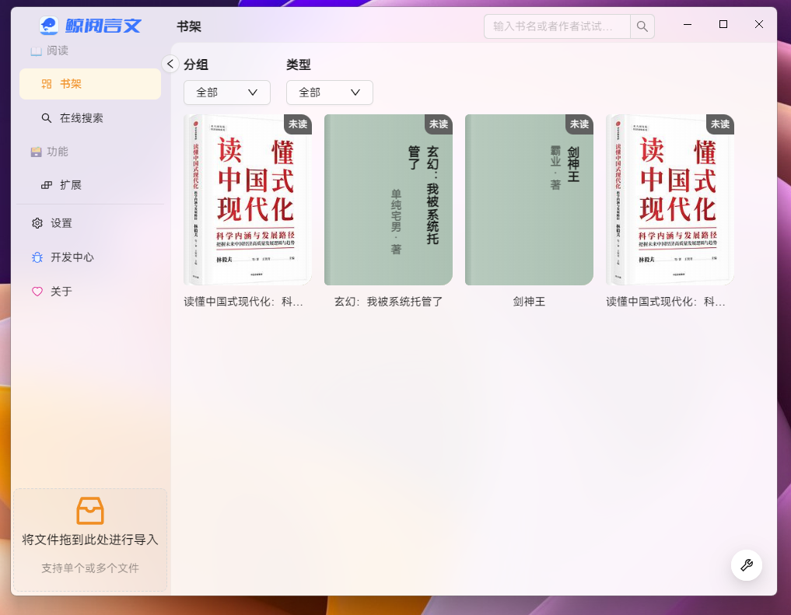
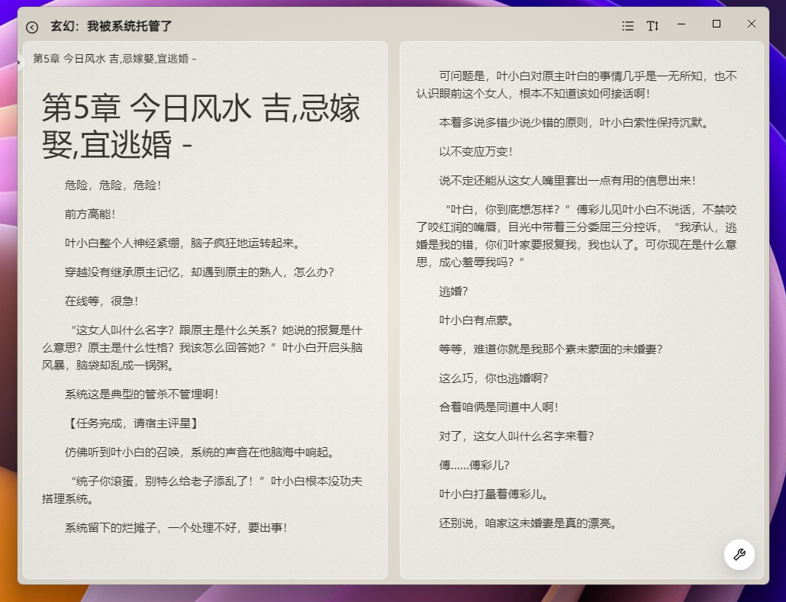

# 鲸阅言文 废弃的版本
它基于[electron ](https://github.com/electron/electron) +  [Ant Design 5](https://github.com/ant-design/ant-design)
这是一个搁置了半年的项目，现在发现代码有些屎山，所以不打算继续开发了。
准备重新开发这个程序，所以现在将它开源。
我并没有写编译脚本，如果你需要编译成exe，需要您自己实现。

## 新版本

我们将会基于这个项目，重新开发此程序。

让程序更加的强大。

## 截图






> 使用键盘 ← →键可翻页

## 安装依赖

```
$ cnpm i 
//or
$ npm i
```

## 启动项目

```
$ npm start
```
## 编译前端文件
```
$ npm run build 
```

